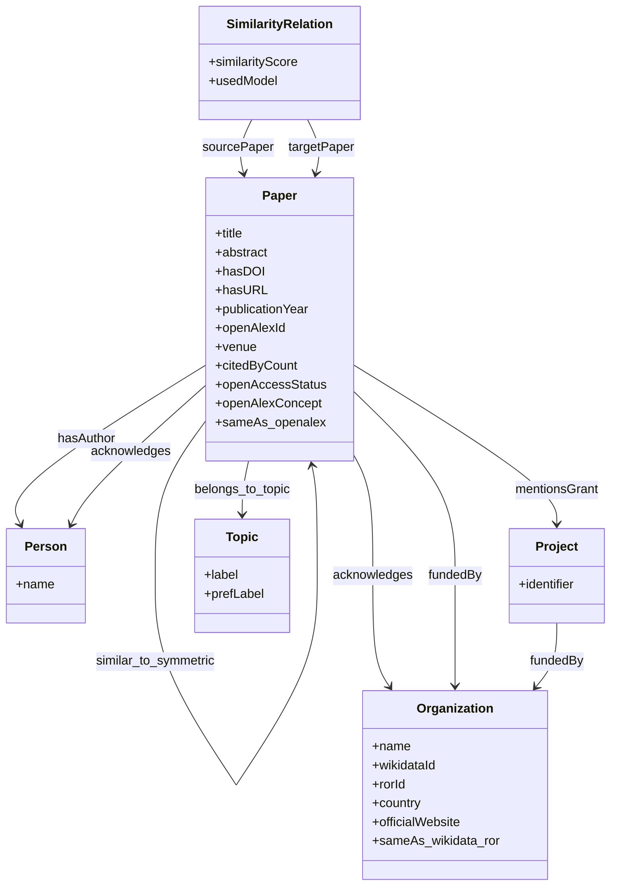

# Ontology Diagram

Visual overview of the `oskg` ontology used in the Knowledge Graph. It shows the six main classes, their key attributes, and the main relations between papers, topics, people, organizations, grants and similarity links.

## Reading the diagram

The ontology represents research papers, authors, acknowledged people and organizations, grants, topics and similarity relations. External enrichment adds OpenAlex metadata to `Paper` nodes and Wikidata/ROR information to `Organization` nodes.

Main relations include topic assignment, paper similarity, authorship, acknowledgements, grants and funding links.

## Namespaces

| Prefix    | IRI                                    |
| --------- | -------------------------------------- |
| `oskg`    | `http://example.org/oskg/ontology#`    |
| `res`     | `http://example.org/oskg/resource/`    |
| `dcterms` | `http://purl.org/dc/terms/`            |
| `foaf`    | `http://xmlns.com/foaf/0.1/`           |
| `skos`    | `http://www.w3.org/2004/02/skos/core#` |
| `prov`    | `http://www.w3.org/ns/prov#`           |
| `owl`     | `http://www.w3.org/2002/07/owl#`       |
