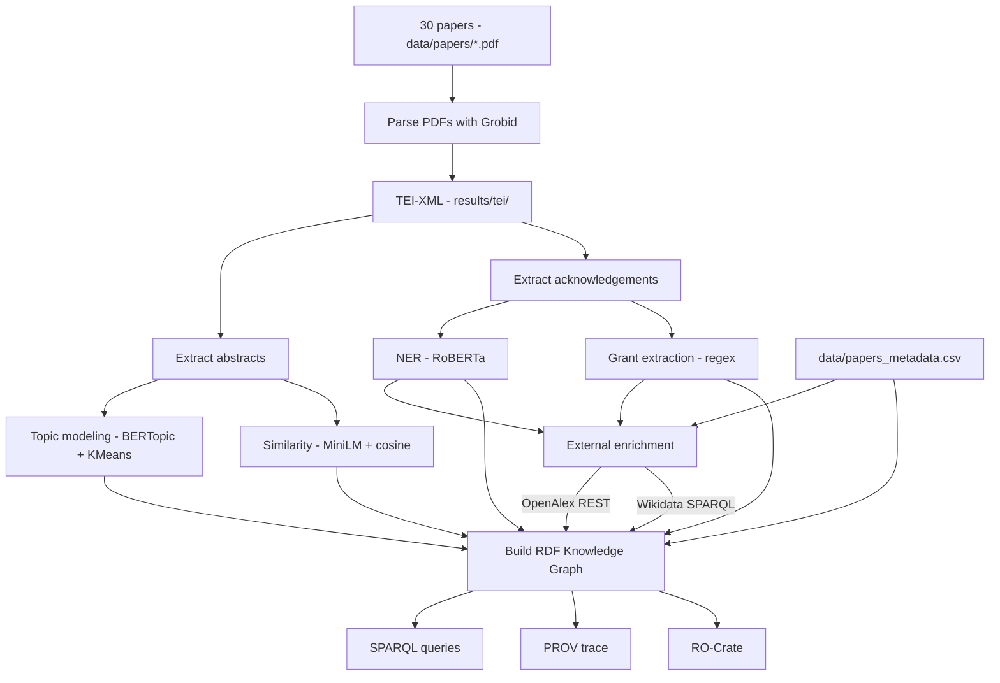

# Workflow

## Diagram



## Steps

| #  | Step               | What it does                                               | Main output                                         |
| -- | ------------------ | ---------------------------------------------------------- | --------------------------------------------------- |
| 1  | `parse`            | Converts PDFs into TEI-XML using Grobid                    | `results/tei/*.xml`                                 |
| 2  | `abstracts`        | Extracts abstracts from the TEI files                      | `results/abstracts.json`                            |
| 3  | `acknowledgements` | Extracts acknowledgement sections                          | `results/acknowledgements.json`                     |
| 4  | `topics`           | Groups papers by topic using BERTopic + KMeans             | `topics.csv`, `topic_words.csv`                     |
| 5  | `similarity`       | Computes paper similarity using MiniLM + cosine similarity | `similarity_scores.csv`, `similar_papers_edges.csv` |
| 6  | `ner`              | Extracts people and organizations from acknowledgements    | `ner_entities.json`                                 |
| 7  | `grants`           | Extracts grant/project IDs with regex                      | `grant_ids.csv`, `funding_relations.csv`            |
| 8  | `evaluate`         | Checks extraction quality against manual annotations       | `ner_evaluation.csv`                                |
| 9  | `enrich`           | Adds OpenAlex and Wikidata/ROR metadata                    | `external_enrichment.json`, `external_links.csv`    |
| 10 | `kg`               | Builds the RDF Knowledge Graph                             | `results/knowledge_graph.ttl`                       |
| 11 | `prov`             | Generates the provenance trace                             | `provenance/sample_run_prov.ttl`                    |
| 12 | `rocrate`          | Packages the project as a Research Object                  | `ro-crate/ro-crate-metadata.json`                   |

## Manual steps

Some parts are done manually:

* placing the 30 PDFs in `data/papers/`;
* filling `data/papers_metadata.csv`;

## Running

```bash
python -m src.pipeline --config config/config.yaml
python -m src.pipeline --steps kg,prov,rocrate
python -m src.pipeline --skip parse
```

In simple terms, the workflow starts with the PDFs, extracts text and metadata, analyzes topics, similarity, acknowledgements and grants, enriches the data with external sources, and finally builds the Knowledge Graph, provenance trace and RO-Crate package.
